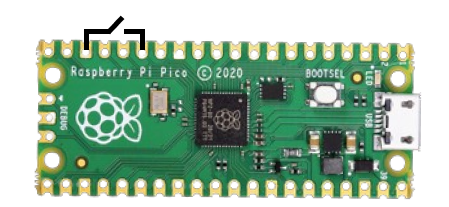

# NotAKeyboard
Another USB HID device. The name is inspired by NaK, the extremely dangerous Na and K alloy.

## Setup

- You first need to conect GPIO11 with a switch to GND like the upper image, set the switch to off
- Connect the Raspberry Pi Pico to your computer while holding down the BOOTSEL button. When it appears as a removable storage device, release the BOOTSEL button.
- Download this repository and extract it, open the **format_pico** folder from the files provided. Copy the flash_nuke.uf2 file to the Raspberry Pi Pico. Wait until it restarts. This process clears the existing firmware.
- Open the **software** folder. Copy the **adafruit-circuitpython-raspberry_pi_pico-en_US-9.1.1.uf2** file to your Raspberry Pi Pico. Wait until it restarts. After restarting, the Pico should appear as a drive named CIRCUITPY.
- Copy the **lib** folder on the CIRCUITPY drive, click replace if it asks.
- Copy the **payload.py**, **code.py** and **boot.py**, click replace if it asks. Congratulations! Your NaK is set up and ready to go. (WARNING: MAKE SURE THAT THE SWITCH ISEN'T ON)
